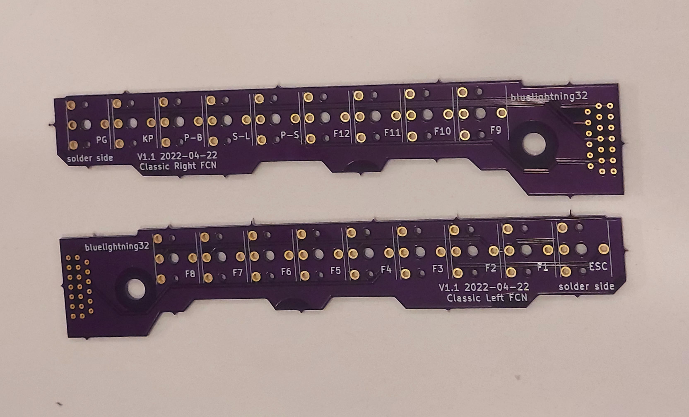
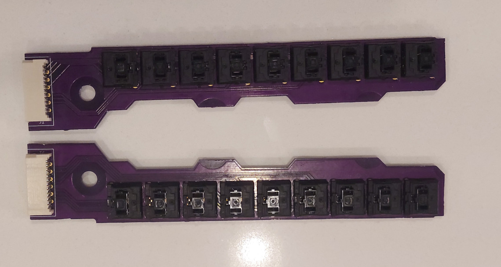
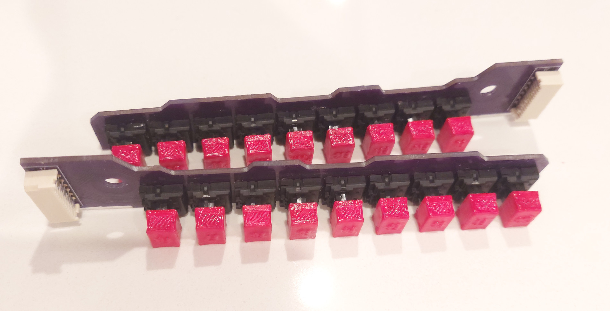
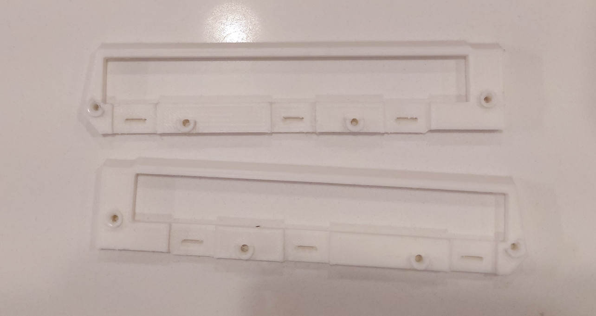
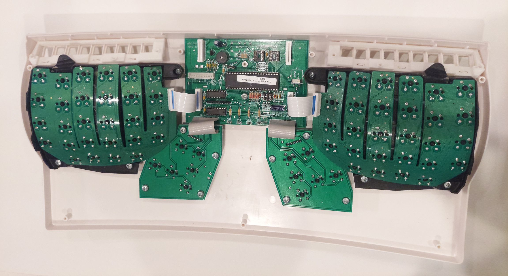
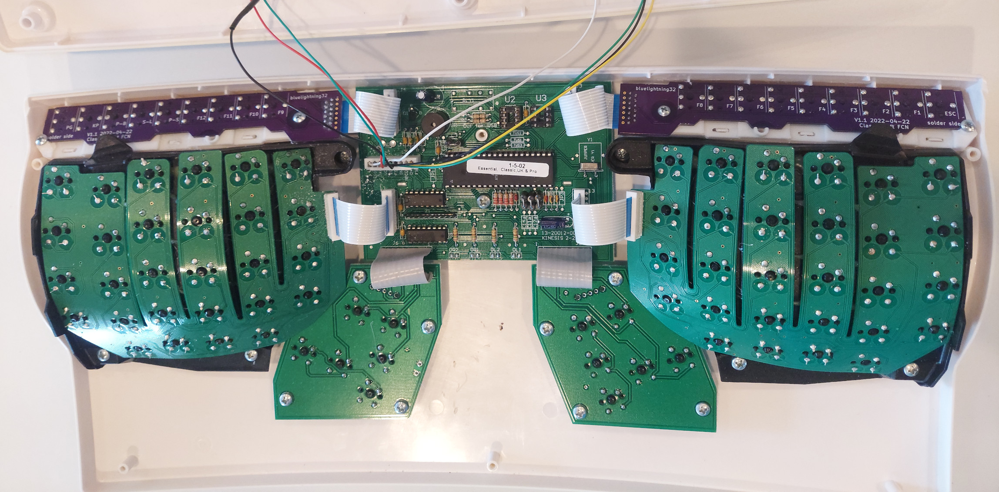
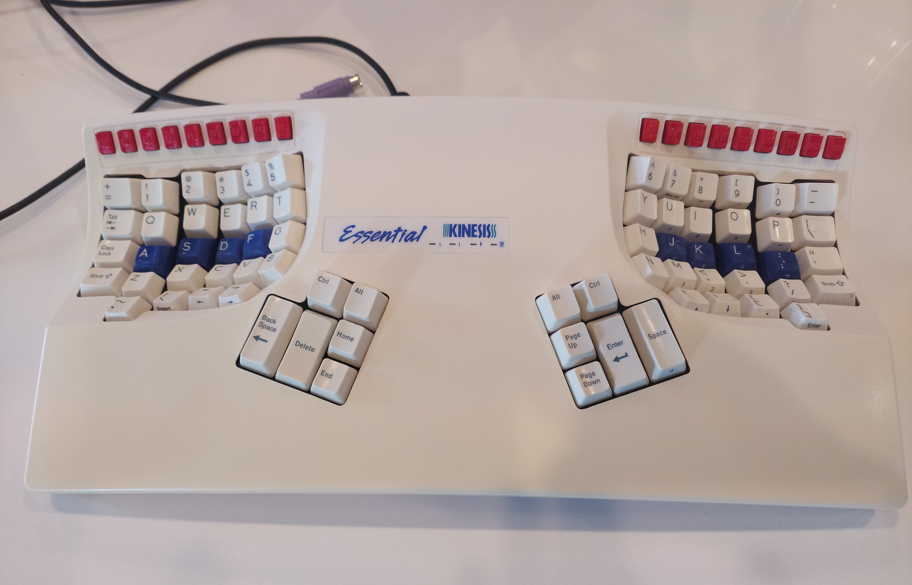

This project is about replacing the function keys on the Kinesis Essential and Kinesis Advantage keyboards. The Kinesis Advantage2 has a slightly different keyboard matrix, and as such this project is incompatible with it.

# Required tools

1. Soldering equipment
2. 3d printer
3. Screw driver
4. Diagonal cutters
5. Needle files to file down imperfections in the 3d printed keycaps, and in the replacement circuit boards.

# Bill of materials

1. Left replacement circuit board (order from a circuit board fabricator)
2. Right replacement circuit board (order from a circuit board fabricator)
3. 18 ML1A-11JW cherry mechanical key switches. [Digikey](https://www.digikey.com/en/products/detail/cherry-americas-llc/ML1A-11JW/16990?s=N4IgTCBcDa5gbPAtAWQDIEYCCSMYFIDqSAcgCIgC6AvkA) had the best price I could find, but they are out of stock right now.
4. 2 flat flex cables with 13 pins and 1.25mm pitch. They need to be at least 50mm long, but longer is okay. The pitch (distance between pins) must be correct. If necessary, you can buy a cable with more pins and cut off the extra. I could only find this on [AliExpress](https://www.aliexpress.us/item/3256801627091246.html?spm=a2g0s.12269583.0.0.629a404dzJNHRq&gatewayAdapt=glo2usa4itemAdapt).
5. 2 connectors for the flat flex cables. This [connector](https://www.digikey.com/en/products/detail/molex/0039532135/3160262?s=N4IgTCBcDaIOoFkCMAWArGAbAWgHIBEQBdAXyA) from Digikey should be an exact fit. This [connector](https://www.aliexpress.us/item/2251832596444359.html?spm=a2g0o.order_list.order_list_main.30.21ef1802ZNNYwS&gatewayAdapt=glo2usa4itemAdapt) from AliExpress will fit if you bend the pins a little.
6. 4 screws. #4 3/8 inch pan head. These are common in American hardware stores.
7. Filament for the 3d prints
8. (optional) super glue or gorilla glue to better secure the supports.
9. (optional) nail polish to color the keycaps.

# Directions

Order the left and right circuit boards from a circuit board fabricator. The fabricators want the gerber files, which are in the left-gerbers and right-gerbers directories.

Solder the key switches and the flat flex connectors onto the boards. The components go on the on labeled side, and the solder goes on the labeled side (it also says solder side). Remember to use flux.

Print the keycaps (keys.stl). To make the keycap tabs strong enough, the keycaps need to be printed on their side. This unfortunately reduces the print quality of the embossed labels.

Optionally paint the keycaps with nail polish to hide some of the 3d print imperfections. Do not paint the bottom part of the key cap the inserts into the key switch (it won't fit if you try). Insert the keycaps into the keyswitches. Use the needle file to adjust the keycap support if it does not fit.

Print the supports (support.stl).

Remove the old function keys from the keyboard. They are heat staked in place. So the easiest way is to use diagonal cutters to remove the top of the heat stake. After removing the heat stake, it will be very difficult to use the original function keys again.

Add the supports to the keyboard. They should somewhat snap into place, partially secured with the remaining stems of the heat stakes. The supports will not be fully secure until the screws are added later.

Connect the function row boards to the main board using the flex connectors. Before putting the keyboard back together, hook it up to a computer and verify that the new function keys work. `xev` is a good Linux program to test most of the keys. Use the keyboard's click sound to verify that the last two (keypad and program) work.

If the keys do not work, it might be due to the flex cable. If the flex cable is slightly narrower than the connector, try placing the cable all the way to the left or right of the connector, to align the pins. Also verify that the flex connector is not upside down (silver side faces away from the center of the main board).

Snap the circuit boards into the supports. Secure them with 2 screws each. Verify that the function keys can be pressed smoothly. If the new keycaps bind with the case, then use the needle files to either file the screw holes of the circuit board so that it can be shifted, or file the keycaps.

After the key position has been verified, take the boards back out, squirt some glue in the screw holes, then screw them back in place. This step is optional. The screws mostly hold the boards in place without the glue, but if one presses the keys very hard, the screws alone will not hold, and the board will shift.

Reassemble the keyboard.

